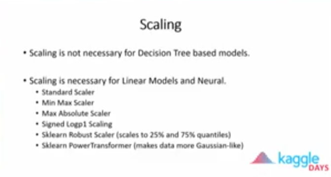
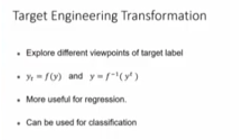
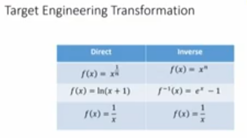
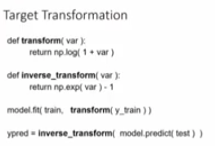
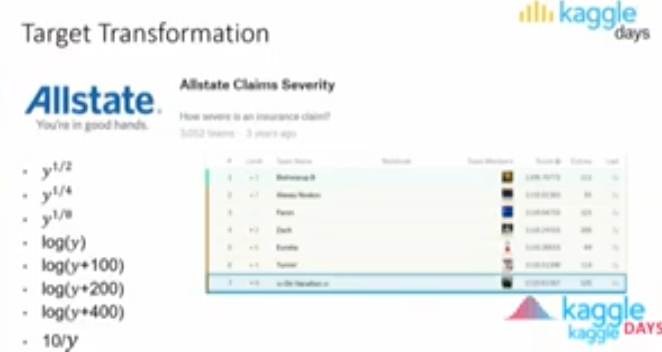
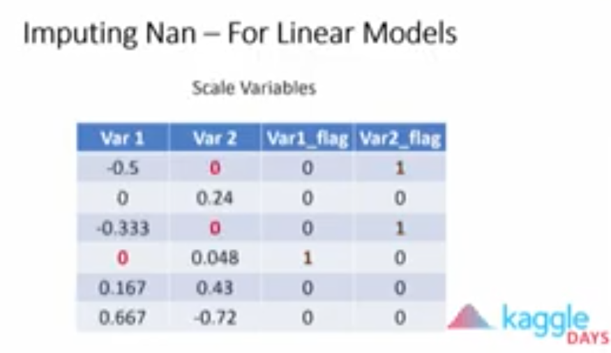
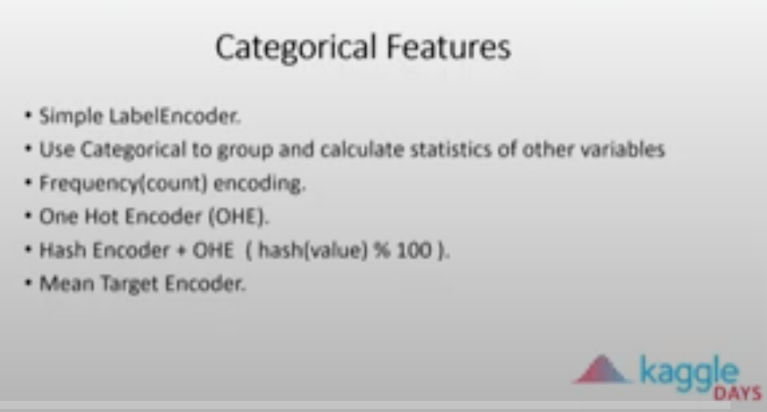
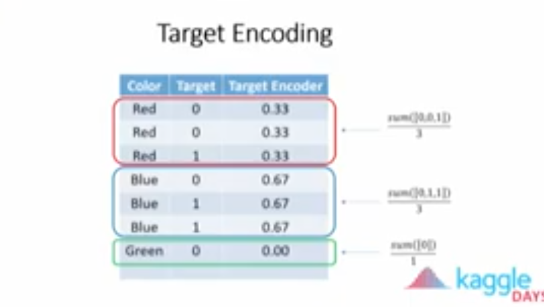
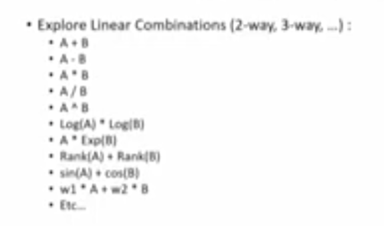

# Kaggle tips and tricks
From diferent sources (Gilberto Titericz at Kaggle Days, Analytics Vidhya...)

* Exploratory Data Analysis
* Feature pre-processing
* Feature engineering
* Model selection
* Hyperparameter optimization


## Exploratory Data Analysis

Check if the problem is a hidden time series problem

Check correlation between feature and target


## Feature pre-processing


### Scaling



Scaling makes difference for linear models and neural networks. For linear models it's necessarry to try different scaling strategies.

A good reason to start with decision trees when working on a new dataset is that they do not need to scale.









In this competition, Gilberto got top 7 rank by creating a different model scaling the target as per the formulas above and ensembling the different models


### NaN imputation

Add Extra column to tell the model that the feature and row was imputed




**Mean Target Encoder**
* Replace the category by the mean of 
* Works for classification and regression problems.
* Works better for high cardinality variables
* Must be processed using CV or out-of-fold encoding


A new feature (Kfold_mean_Enc) is created using Mean Target Encoder strategy by using Cross Validation. This approach reduces the overfitting on the test set that simple Mean Target Encoding would cause.
* Split the train set in K folds.
* For each fold the value of Kfold_mean_Enc is the mean of the target values of the categorical common values in the this fold. 
* To generate the Kfold_mean_Enc feature in the test set, the mean value of Kfold_mean_Enc in the trains set per categorical value can be used.

[Mean Target Encoder explained](https://medium.com/@pouryaayria/k-fold-target-encoding-dfe9a594874b)


## Feature Engineering

Linear combinations of features (2-way, 3-way)


3-way + 5-fold Mean Target Encoder gives good results in the test set

```
def target_encode_simple (df_train,df_valid,col,target):
    dt = df_train.groupby(col)[target].agg(['mean]).reset_index(drop=False)
    tmp = df_valid.merge(dt,on=col,how='left')['mean'].values
    return tmp

```

Aggregate one numerical feature based on a categorical feature. For example in the Titanic dataset, agregate the age feature by passenger class feature (mean, count, maximum, minim, std, skewness)
train.group(['class'])['Age'].agg(['count','mean','min','max','skew']).reset_index()

In Time Series, for Kaggle competitions, define lag that fit correctly depending on the test set size.

**Dimension reduction**

Adding the features coming from dimension reduction to the original features.
* PCA
* LDA
* SVD
* t-SNE
* Nearest Neightbour
* Autoencoder

**Denoising autoencoder**

We can generate from the internal layer to generate extra features. We add some noise to the input.
But how to add noise to the inputs? Instead of just adding noise to the entire variable, switch for example only 30% of the rows in some specific columns. By using this technique we do not change the variable distribution.

**Clustering**

Using clustering algorithms to generate new features. Try more than one algorithm to create categorical based on the clusters or the cluster distance metrics.

* K-means
* Affinity propagation
* Mean shift
* Spectral clustering
* DBSCAN
* Agglomerative clustering
* Optics
* Birch

**GDBT tree leaves**

Ask the GDBM to return the leave of the prediction.
The strategy is to use this leave as a weak feature.

For example, fit a lightgbm for for 100 rounds (trees) using num_leaves=10. Leaf prediction function returns a matrix of shape (nrowsx100), each column have a leave index ranging from 0 to 9.

**Natural Language Processing (NLP)**
* Bag of Words/NGrams
* Tf-Idf
* Transfer Learning using DL (word embeddings)
* Double translation (remove noise/add). Use the translation services to Spanish, and then translate back to English.


## Feature selection

Classical algorithms: Forward Selection, Backward Elimination, Recursive Feature Elimination (sklearn RFE).

**Use GDBT Feature importance information:**
1. Build a LightGBM model using only train fold and compute feature importance.
2. Drop features with importance below certain threshold and train the model again.
3. Use that model to predict the validation/test set.

**Random Noise Feature importance**

1. Add a feature that is pure noise. 
2. Train a GDBT or Linear model and compute the feature importance. 
3. If there is a feature below the random values feature, probably makes sense to drop it.

**Leave One Feature Out(LOFO)**

Remove one feature each time and compute the difference of the new metric and the initial metric using all features.
How to remove a feature?
1. Hard write a fixed value
2. Hard write the mean average
3. Shuffling

**Adversarial validation**

Try to detect differences in the distributions from train and test set. Classify if a row comes from the train set or from test set.
How:
1. Concatenate train+test set.
2. Target variable 0 to all train rows, 1 to test rows.
3. Build a model.
4. If AUC metric >> 0.5 means that is easy for the model to distinguish between train and test rows.
5. Compute feature importance and have an idea which feature is responsible for the bias between train and test set.

## Model selection


## Hyperparameter optimization


## Cross validation for Time series

Walking forward strategy. Ex. Take 1 week (train) + 2 days(validation), then walk forward a few days and again take 1 week (train) + 2 days


